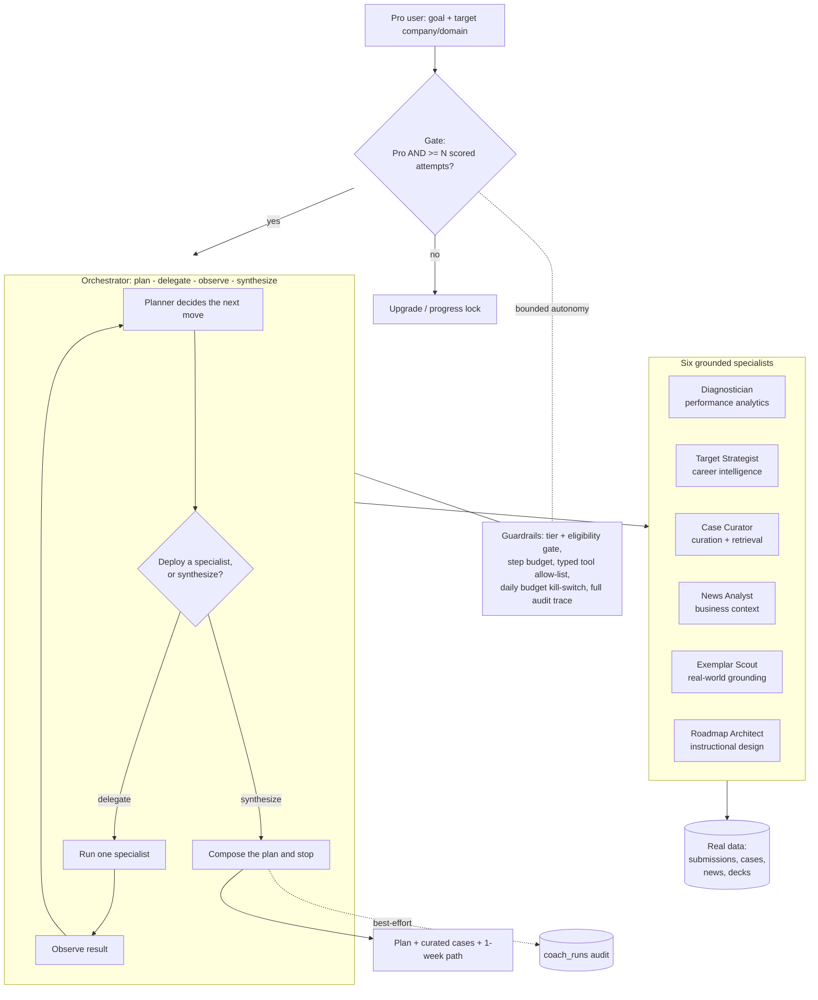

# MECE Prep Copilot — Install, Demo & Architecture Guide

A **per-user, Pro-gated, genuinely agentic** prep coach for meci.in. It reads a
candidate's real graded history, asks where they want to go, and **plans** a
personalised prep path by **orchestrating a team of six domain specialists** —
deciding at runtime which to deploy, reading each result, and synthesising a
weekly plan. It ships with a deterministic **admin demo** that always works on
stage (no API key, no budget, no data required).

This guide covers: what you're shipping, how to apply it with zero drama, how to
demo it, the architecture, and the questions a sharp Agentic-AI PM will ask —
with answers.

---

## 1. What's in the two patches

**`mece-coach-backend.patch`** (FastAPI, 8 files, one 2-line edit to `main.py`, the rest new & self-contained):

```
main.py                          +2   (register the coach router)
routes/coach.py                 new   (/coach/info, /coach/run, /coach/demo, /coach/demo/candidates)
services/coach/__init__.py      new   (light, always-importable exports)
services/coach/schemas.py       new   (typed step / result structures)
services/coach/specialists.py   new   (the 6 grounded domain specialists)
services/coach/orchestrator.py  new   (the plan → delegate → observe → synthesize loop)
services/coach/simulation.py    new   (sample candidates + deterministic planner)
services/coach/live.py          new   (Supabase user-scoped reads + OpenAI planner)
```

**`mece-coach-frontend.patch`** (Next.js, 5 files, two tiny nav edits, the rest new):

```
app/(app)/coach/page.tsx                  new   (Pro user page: gate → intake → watch-it-think → plan)
app/(app)/admin/prep-copilot/page.tsx     new   (admin stage demo)
components/app-nav.tsx                     +3   (Pro-only "Prep Copilot" nav link)
components/admin/admin-nav.tsx             +1   (admin "Prep Copilot" nav link)
supabase/migrations/0062_coach_runs.sql   new   (optional audit table)
```

**Nothing existing is removed or rewritten.** The only in-place edits are three
additive lines (one router include, two nav entries), anchored on stable lines.
The coach is **read-only against every existing table** — it only ever *writes*
to its own new `coach_runs` table, and even that is best-effort.

---

## 2. Apply it (the Antigravity / git commands)

Both patches are standard `git diff` output and apply at the **repository root**.
Because your live GitHub equals the zips these were built against, they apply
cleanly (verified with `git apply --check` against a fresh checkout).

### Backend repo

```bash
# from the root of the backend repo
git checkout -b feat/prep-copilot
git apply --check mece-coach-backend.patch   # dry run — should print nothing
git apply mece-coach-backend.patch
git add -A && git commit -m "feat(coach): per-user agentic Prep Copilot"
git push origin feat/prep-copilot            # open a PR, or push to main to auto-deploy
```

### Frontend repo

```bash
# from the root of the frontend (company) repo
git checkout -b feat/prep-copilot
git apply --check mece-coach-frontend.patch
git apply mece-coach-frontend.patch
git add -A && git commit -m "feat(coach): Pro Prep Copilot + admin demo"
git push origin feat/prep-copilot
```

**Antigravity prompt** (paste this with the two files attached):

> Apply `mece-coach-backend.patch` at the root of the backend repo and
> `mece-coach-frontend.patch` at the root of the frontend repo using `git apply`.
> First run `git apply --check` on each; if it passes, apply, commit on a new
> branch `feat/prep-copilot`, and push. Do not modify any other files.

If a repo isn't a git checkout, `patch -p1 < mece-coach-backend.patch` from the
repo root does the same thing.

---

## 3. Wire it up (three small, optional steps)

1. **Migration (optional but recommended).** Apply `0062_coach_runs.sql` the way
   you apply the others (e.g. `supabase db push`, or paste it into the Supabase
   SQL editor). The feature **works without it** — `/coach/run` inserts the audit
   row best-effort and silently skips if the table is absent — so this can never
   block the deploy.

2. **Env var (optional).** The unlock threshold defaults to **4** completed
   scored attempts. To change it without a redeploy, set `COACH_MIN_ATTEMPTS` on
   Render.

3. **Redeploy.** Push triggers your normal pipeline — Render for the backend,
   Vercel for the frontend. No new dependencies were added to either project
   (the copilot reuses your existing OpenAI client, Supabase client, auth, tier
   guard, rate limiter and budget guard), so there's nothing new to install.

Live (model-driven) mode uses your existing OpenAI configuration. If the key is
absent or the daily budget guard trips, the copilot automatically falls back to
the **guided planner running over the user's real data** — so it degrades
gracefully instead of erroring.

---

## 4. The 90-second demo

**In the admin panel → "Prep Copilot".** Pick a sample candidate and hit **Run
copilot**. The trace reveals one move at a time: the planner reasons, deploys a
specialist, observes what came back, then plans the next move.

Show the divergence — this is the whole point:

- **Aarav** (weak on quant, targeting Goldman) → the planner curates
  **guesstimates** and builds a **quant-first** roadmap.
- **Diya** (weak on synthesis, targeting McKinsey) → it curates a **case** and
  builds a **synthesis-first** roadmap.
- **Kabir** (no graded attempts yet) → the planner **short-circuits**: it deploys
  only the target strategist and stops, refusing to invent a diagnosis from no
  data.

**The one line to say on stage:**

> "Same feature, three candidates — and the agent runs a *different* number of
> specialists in a *different* order for each, because it decides the plan at
> runtime from their data. Nobody scripted these paths."

Then open **Prep Copilot** as a Pro user to show the real thing: it prefills the
goal from their profile, runs live over their own attempts, and ends with
clickable "practice these next" cases and a one-week path.

---

## 5. Architecture / flow



**Two planners, one loop.** The identical orchestrator loop runs both the live
OpenAI function-calling planner (production) and the deterministic planner (admin
demo and graceful fallback). That's how the demo proves the machinery is real
independent of the model.

**Grounded specialists, planning model.** Every *fact* a specialist states is
computed from real data or a small curated map. The model's job is the
**orchestration** — which specialist, when, with what arguments — plus the final
narration. So the autonomy is genuine while the outputs don't hallucinate firms,
scores, or cases that don't exist.

---

## 6. Why this is *agentic AI*, precisely

- **Model-chosen control flow.** The planner picks which specialists to deploy,
  in what order, with what arguments, and when to stop — from what it has learned
  mid-run. Different candidates get different teams and different-length runs
  (Kabir's early stop is the proof).
- **ReAct-style loop.** Observe → reason → act, repeated, with each specialist's
  result fed back before the next decision.
- **Model-decided termination.** The planner calls `synthesize` itself; it isn't
  a fixed number of stages.
- **A real side effect.** It persists a personalised plan (`coach_runs`) and
  surfaces clickable next actions — it changes the user's world, it doesn't just
  chat.
- **Bounded autonomy.** Pro + eligibility gate, a hard step budget, a typed tool
  allow-list (the planner can only call the six specialists), a daily-budget
  kill-switch, and a complete audit trace. Autonomy with a seatbelt.

---

## 7. Questions a sharp PM will ask (with answers)

**"Why does coaching deserve an agent when your scoring doesn't?"**
Because they're different problem shapes. Scoring one answer is a bounded,
single-shot judgement — an agent loop there would add latency, cost and
non-determinism for no gain, so it's deliberately *not* agentic. Coaching is
open-ended and multi-domain: it has to diagnose, interpret a target, retrieve,
contextualise with news, find exemplars and sequence a plan — and the right set
and order of those steps depends on the person. That's exactly where planning and
orchestration earn their keep. We used an agent where the problem is genuinely
agentic and a plain call where it isn't — which is the point.

**"How do I know it isn't just a prompt with fancy labels?"**
Watch the trace: the number of specialists and their order change per candidate,
chosen at runtime. The loop, the specialists and the delegation are the same code
objects whether a model or the deterministic planner is driving — the admin demo
runs with no model at all and still orchestrates. And the specialists are real
functions hitting real tables, not the model role-playing tools.

**"Does it hallucinate cases or firms?"**
No. Recommended cases come from your `cases` table (real ids, real titles, and
they're filtered to ones the user hasn't attempted). Firm emphasis comes from a
small explicit map, framed as guidance, not invented specifics. The one piece of
generated text — a bespoke "stretch" case — is clearly labelled and kept
**private to that user's plan**; it is never inserted into the shared case bank,
so it can't leak into other users' practice or the leaderboard.

**"What stops it going rogue / running up a bill?"**
A typed allow-list (only the six specialists are callable), a hard step budget, a
per-user rate limit, and your existing daily-budget guard that returns 503 and
triggers the guided fallback. Every run is auditable in `coach_runs`.

**"What happens when OpenAI is down or over budget?"**
`/coach/run` never returns a 5xx. It catches the failure, notes it in the
response, and re-runs with the deterministic planner **over the user's real
data** — so the user still gets a grounded, personalised plan.

**"Can a free user or a not-yet-warmed-up user hit it?"**
No. The backend enforces Pro (`assert_tier_at_least`) and the attempt threshold
independently of the UI; the nav link and page gates are just UX on top.

---

## 8. Honest status

- Both patches **dry-run-apply cleanly** to a fresh checkout of the current repo
  state (`git apply --check` passed for each).
- The **backend imports and runs**: the orchestrator was executed across all
  three sample candidates and produced correct, divergent plans; all reused
  helper imports and call signatures were verified against the live services.
- The **frontend typechecks**: `tsc --noEmit` reports **0 errors** on the tree
  with the patch applied.

What I can't promise from here is the state of your *running environment* —
environment variables, live table/column drift, or deploy-pipeline specifics are
outside this sandbox. But the feature is designed to fail safe: it's read-only
against your existing data, every external call is guarded and falls back, and
the audit insert is best-effort. If something in the environment is off, the
worst case is the copilot degrades to the guided plan or shows a friendly error —
not that existing functionality breaks.
